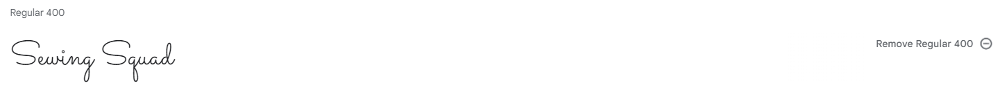
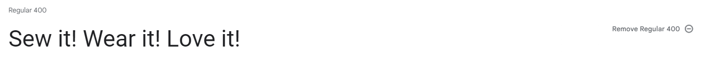
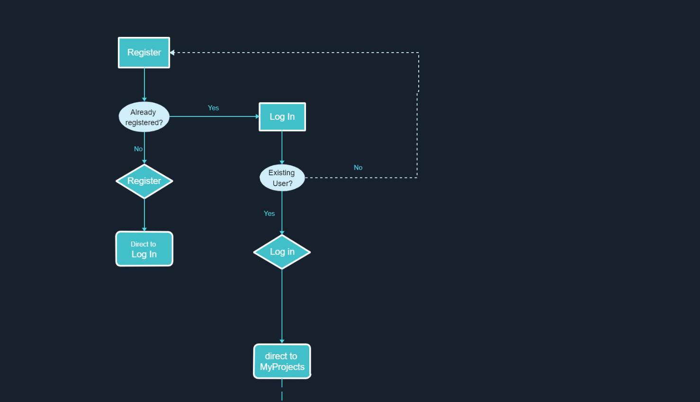
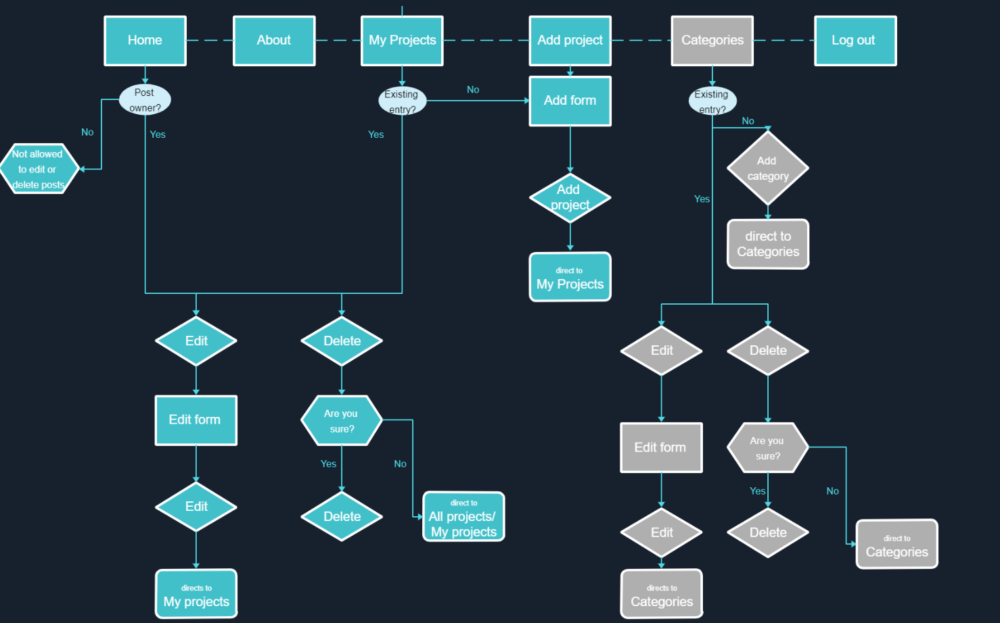
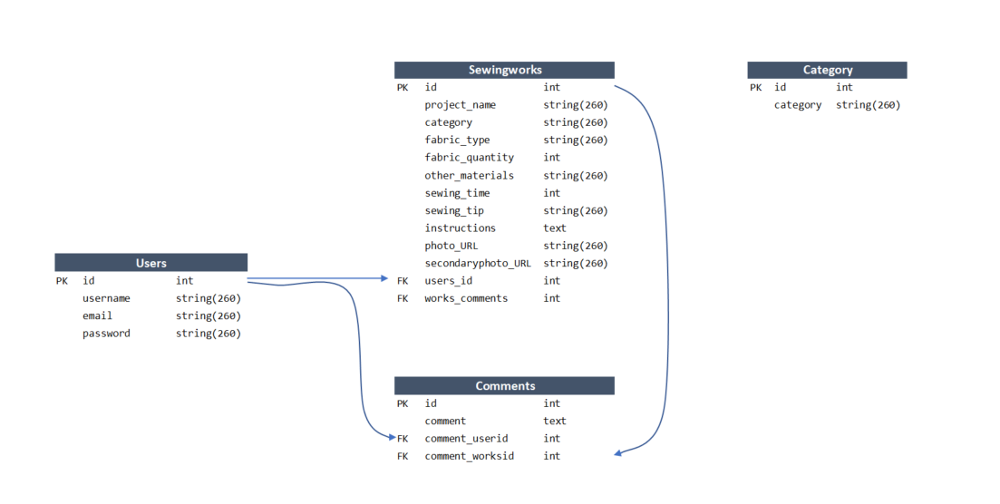
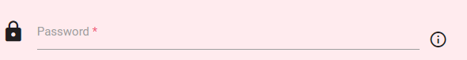

# *Sewing Squad* 


Link to the page: [Sewing Squad](https://vero-nika-2828.github.io/yasmin-jas-photography/)


# Project Overview


Sewing Squad is a friendly community of people who share the same passion for sewing, making their own clothes. They desire to combine their skills together with those of others to not only become better seamsters/seamstresses themselves but to help others reach their potential. 

The platform facilitates /enables the members to share their patterns, sewing instructions and advice/tips on making the garment more customised/ to alter the garments to fit their style. The squad consists of members of variety of ages and experience levels.


# Project objectives


## User Goals


* Find people who share the same interest
* Get inspiration from other people’s creations
* Store my work  
* Post some of my work for others to see
* Help others with their sewing journey 


## Site Owner Goals


* Build a community of people who are passionate about sewing
* Enable users to share their sewing projects with others
* Enable users to save their own projects
* Encourage people to register (plant charge for membership in the future)
* Make it easy for users to navigate across the site


# User Experience


## User Stories


### Target user


* People who are interested in sewing 
* People who want to get some ideas for their sewing projects
* People who like fashion 
* People who like making their own clothes
* People who want to share their ideas with others
* People who want to learn hot to make new clothes 
* People who want to improve their sewing skills


### First Time Visitor Goals


1. I want to be able to see what this website is for
2. I want to have my own account with my entries
2. I want to be able to create my own account easily
3. I want to see a confirmation when my account gets created
4. I want to be told clearly what information is needed for registration
5. I want to know what my password should look like0
6. I want to be notified when I fill in something incorrectly or when missed something
7. I want to be able to add my own projects
8. I want to be able to see a list of other people’s projects
8. I want to be able to narrow the list of all the projects that are on the website to what fits my needs
9. I want to see a quick overview of the project to be able to decide whether that I would like to know more about that particular project 
9. I want to see image of the finished product 
9. I want to see more information on the projects that are interesting to me
9. I want to have an option to see more detailed description of project I choose
10. I want to be able to navigate through the website and find information easily 
11. I want to be able to navigate the site across variety of screen sizes
12. I want to be able to view the website on the variety of web browsers
13. I want the links to work when I click on them 
14. I want to be able to read the content effortlessly


### Returning Visitor Goals


15. I want to be able to log in to my account repeatedly
15. I want to be able to navigate the site across variety of screen sizes
16. I want to be given a confirmation that I am logged in 
17. I want to be able to view a list with projects I added
18. I want to be able to go to add a project directly
19. I want to be able to edit my projects
19. I dont want other people to edit my projects
19. I dot want other people to delete my project
20. I want to be able to delete my projects
20. I want to be able to quick find individual projects of interest
21. I want to be able to log out from my account when I finish working with it


### Site owner's Goals 


22. I want to be able to control content on the webpage
22. I want only registered users to be able to view full content
22. I want users to create their account
23. I want to store the user’s project entries in a database
24. I want to be able to retrieve the project entries from database for my website
26. I want the projects entries to be linked to each account
27. I want users to see all the projects in database
28. I want users to be able to read more details on the project of their choice
29. I want users to see their own projects
29. I want to be able to add, amend and delete categories wh
30. I want users to be able to edit their own projects 
31. I want users to be able to delete their own projects 
32. I want users to be able to understand what the website is for
33. I want users to be able to navigate through the website easily


# Design

## Design choices

The site will be visited by people who sew for fun or professionally. The users are expected to visit the website with intention to present and share their work as well as help each other to find easier and more efficient ways to complete their projects. Threrore, the website design will be a mean of presenting each  Therefore, the design elements aim to make it easy to navigate through the site and find and read relevant information. 

## Color Scheme

The main colors of the website are pink and white. Lighter shades of pink are used for nagivation bar, footer and the title. Darker shades of pink were used to hightlight certain information such as project names or buttons. White color was used for text on pink background for better contrast while the rest of the text is in black. 

In addition to main colours, teal color was used for edit buttons and red for delete buttons in order to aid intuitive navidation. 


## Typography

Google Fonts website was used to import the fonts chosen for this website.

Roboto was used as a general font for the website. Sacramento was used for logo in order to give a feel of embroidered letters. San seriff was added in case browser doesn't support the other two fonts. 



## Imagery

The images used by copying email addresses from etsy and other google search. Image addresses are saved in the database.

# Database Scheme & User Journey

## User Journey






## Database Scheme 




# Features

## Register page 

### Registration Form
* Form is positioned in the middle of the screen
* Opens when user clicks Register link in the  Login page or clicks on Log In in navigation menu
* Form contains 3 input fields - username, email address, password
* Each input field has a label with information required for that field 
* Icons prefixed placed in frog of each input field to aid intuitive navigation(quicker comprehension of information required in each field 

## Form error message
* A form with empty fields will not be submitted and a message prompting the user to fill the field will appear (3)


* Information icon on the right side of the password field shows the password requirements  when hovered over 



* Register button  performs the registration and triggers the insertion of input data to database and  directs users to log in page
* When user submits username that already exists, the registration will not be successful and the user will be informed about it with the message 


* Log in link is positioned at the bottom for quick navigation and directs the user to the user to Log in page

## Logo and Navigations Bar

### Header
* Repeats across all pages for consistency and easy navigation
* Logo is positioned on the left size
* Logo brings user to the Home page when clicked
* Links to other pages are placed on the right to maintain the conventions expected by the user
* Navigation menu will turn into hamburger menu on smaller devices
* Hamburger menu opens to show list of other pages
* Relates to following user stories:


### Footer
* Repeats across all pages for consistency and easy navigation
* Logo is centred in the middle
* Logo brings user to the Home page when clicked
* Links bring the user to the Github repositories or Linked in
* Links open in a new tab
* Links get bigger when hovered over for easier navigation
* Link description added for accessibility and SEO
* Relates to following user stories: 


Welcome Veronika Nemergutova,

This is the Code Institute student template for Gitpod. We have preinstalled all of the tools you need to get started. It's perfectly ok to use this template as the basis for your project submissions.

You can safely delete this README.md file, or change it for your own project. Please do read it at least once, though! It contains some important information about Gitpod and the extensions we use. Some of this information has been updated since the video content was created. The last update to this file was: **September 1, 2021**

## Gitpod Reminders

To run a frontend (HTML, CSS, Javascript only) application in Gitpod, in the terminal, type:

`python3 -m http.server`

A blue button should appear to click: _Make Public_,

Another blue button should appear to click: _Open Browser_.

To run a backend Python file, type `python3 app.py`, if your Python file is named `app.py` of course.

A blue button should appear to click: _Make Public_,

Another blue button should appear to click: _Open Browser_.

In Gitpod you have superuser security privileges by default. Therefore you do not need to use the `sudo` (superuser do) command in the bash terminal in any of the lessons.

To log into the Heroku toolbelt CLI:

1. Log in to your Heroku account and go to *Account Settings* in the menu under your avatar.
2. Scroll down to the *API Key* and click *Reveal*
3. Copy the key
4. In Gitpod, from the terminal, run `heroku_config`
5. Paste in your API key when asked

You can now use the `heroku` CLI program - try running `heroku apps` to confirm it works. This API key is unique and private to you so do not share it. If you accidentally make it public then you can create a new one with _Regenerate API Key_.

------

## Release History

We continually tweak and adjust this template to help give you the best experience. Here is the version history:

**September 1 2021:** Remove `PGHOSTADDR` environment variable.

**July 19 2021:** Remove `font_fix` script now that the terminal font issue is fixed.

**July 2 2021:** Remove extensions that are not available in Open VSX.

**June 30 2021:** Combined the P4 and P5 templates into one file, added the uptime script. See the FAQ at the end of this file.

**June 10 2021:** Added: `font_fix` script and alias to fix the Terminal font issue

**May 10 2021:** Added `heroku_config` script to allow Heroku API key to be stored as an environment variable.

**April 7 2021:** Upgraded the template for VS Code instead of Theia.

**October 21 2020:** Versions of the HTMLHint, Prettier, Bootstrap4 CDN and Auto Close extensions updated. The Python extension needs to stay the same version for now.

**October 08 2020:** Additional large Gitpod files (`core.mongo*` and `core.python*`) are now hidden in the Explorer, and have been added to the `.gitignore` by default.

**September 22 2020:** Gitpod occasionally creates large `core.Microsoft` files. These are now hidden in the Explorer. A `.gitignore` file has been created to make sure these files will not be committed, along with other common files.

**April 16 2020:** The template now automatically installs MySQL instead of relying on the Gitpod MySQL image. The message about a Python linter not being installed has been dealt with, and the set-up files are now hidden in the Gitpod file explorer.

**April 13 2020:** Added the _Prettier_ code beautifier extension instead of the code formatter built-in to Gitpod.

**February 2020:** The initialisation files now _do not_ auto-delete. They will remain in your project. You can safely ignore them. They just make sure that your workspace is configured correctly each time you open it. It will also prevent the Gitpod configuration popup from appearing.

**December 2019:** Added Eventyret's Bootstrap 4 extension. Type `!bscdn` in a HTML file to add the Bootstrap boilerplate. Check out the <a href="https://github.com/Eventyret/vscode-bcdn" target="_blank">README.md file at the official repo</a> for more options.

------

## FAQ about the uptime script

**Why have you added this script?**

It will help us to calculate how many running workspaces there are at any one time, which greatly helps us with cost and capacity planning. It will help us decide on the future direction of our cloud-based IDE strategy.

**How will this affect me?**

For everyday usage of Gitpod, it doesn’t have any effect at all. The script only captures the following data:

- An ID that is randomly generated each time the workspace is started.
- The current date and time
- The workspace status of “started” or “running”, which is sent every 5 minutes.

It is not possible for us or anyone else to trace the random ID back to an individual, and no personal data is being captured. It will not slow down the workspace or affect your work.

**So….?**

We want to tell you this so that we are being completely transparent about the data we collect and what we do with it.

**Can I opt out?**

Yes, you can. Since no personally identifiable information is being captured, we'd appreciate it if you let the script run; however if you are unhappy with the idea, simply run the following commands from the terminal window after creating the workspace, and this will remove the uptime script:

```
pkill uptime.sh
rm .vscode/uptime.sh
```

**Anything more?**

Yes! We'd strongly encourage you to look at the source code of the `uptime.sh` file so that you know what it's doing. As future software developers, it will be great practice to see how these shell scripts work.

---

Happy coding!
