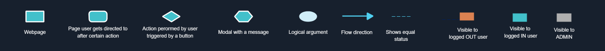
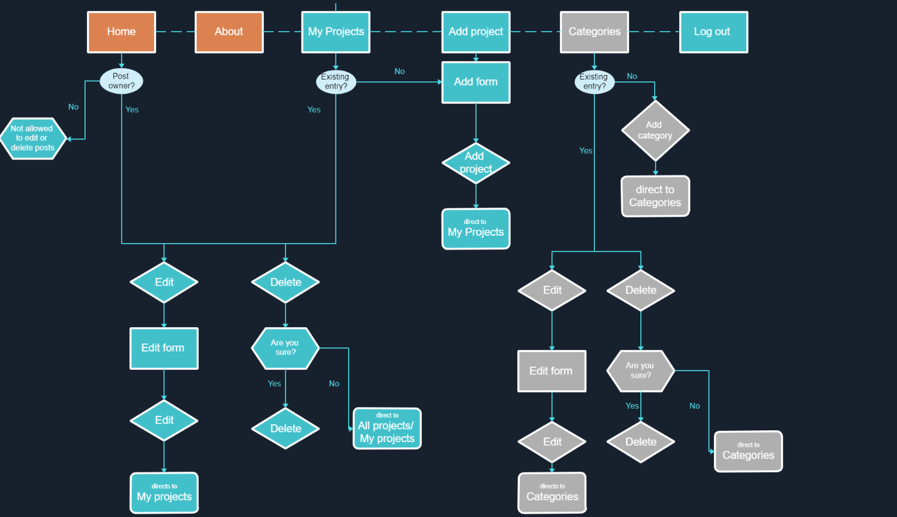
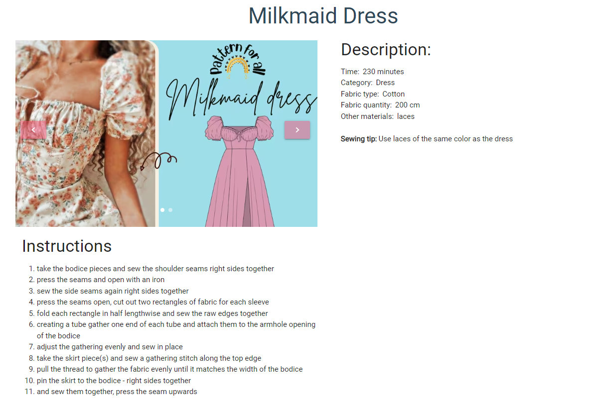

# *Sewing Squad* 

Link to the page: [Sewing Squad](http://sewing-squad-a989d3fdde75.herokuapp.com/)

# Project Overview

Sewing Squad is a friendly community of people who share the same passion for sewing, making their own clothes and fashiong. They desire to combine their skills together with those of others to not only become better seamsters/seamstresses themselves but to help others reach their potential. The platform enables members to share their patterns, sewing instructions and tips on how to sew garments more effectively and how to adjust them to fit sewer's personal style. The squad consists of members of variety of ages, backgrounds and experience levels so everybody can benefit from being part of this community

# Table of Content 

- [Project Overview](#project-overview)
- [Project objectives](#project-objectives)
   - [User Goals](#user-goals)
   - [Site Owner Goals](#site-owner-goals)  
- [User Experience](#user-experience)
   - [Target user](#target-user)  
   - [First Time Visitor Goals](#first-time-visitor-goals)
   - [Returning Visitor Goals](#returning-visitor-goals)
   - [Returning Visitor Goals](#site-owner's-goals)      
- [Design](#design)  
   - [Design choices](#design-choicesr)  
   - [Color Scheme](#color-scheme)
   - [Typography](#typography)  
   - [Imagery](#imagery)    
- [Database Scheme & User Journey](#database-scheme-&-user-journey)
   - [User Journey](#user-journey) 
   - [Database Scheme](#database-scheme) 
- [Wireframes](#wireframes)
- [Features](#features)
   - [Register page](#register-page)
   - [Log in page](#log-in-page)
   - [My projects](#my-projects)
   - [Home page](#home-page)
   - [search](#search)
   - [card](#card)
   - [Add Project Form](#add-project-form)
   - [Edit Project Form](#edit-project-form)
   - [Project page](#project-page)
   - [Comment](#cooment)
   - [Categories (admin only)](#categories-(admin-only))
   - [About page](#about-page)
   - [Log out](#log-out)
   - [404 and 505 error page](#404-and-505-error-page)
   - [Logo and Navigations Bar](#logo-and-navigations-bar)
- [Technologies Used](#technologies-used)
   - [Languages Used](#languages-used)
   - [Frameworks, libraries and programs used](#frameworks,-libraries-and-programs-used)
- [Testing](#testing)
- [Deployment & local development](#deployment-&-local-development)
   - [Deployment](#deployment)
   - [Local Development](#local-development)
      - [How to Fork](#how-to-fork)
      - [How to Clone](#how-to-clone)
- [Credits](#credits)
- [Aknowledgement](#aknowledgement)

# Project objectives

## User Goals

* Find people who share the same interest
* Get inspiration from other people’s creations
* Store my work  
* Post some of my work for others to see
* Help others with their sewing journey 

## Site Owner Goals

* Build a community of people who are passionate about sewing
* Enable users to share their sewing projects with others
* Enable users to save their own projects
* Encourage people to register (plant charge for membership in the future)
* Make it easy for users to navigate across the site

# User Experience

## User Stories

### Target user

* People who are interested in sewing 
* People who want to get some ideas for their sewing projects
* People who like fashion 
* People who like making their own clothes
* People who want to share their ideas with others
* People who want to learn hot to make new clothes 
* People who want to improve their sewing skills

### First Time Visitor Goals

1. I want to be able to see what this website is for
2. I want to have my own account with my entries
3. I want to be able to create my own account easily
4. I want to see a confirmation when my account gets created
5. I want to be told clearly what information is needed for registration
6. I want to know what my password should look like0
7. I want to be notified when I fill in something incorrectly or when missed something
8. I want to be able to add my own projects
9. I want to be able to see a list of other people’s projects
10. I want to be able to narrow the list of all the projects that are on the website to what fits my needs
11. I want to see a quick overview of the project to be able to decide whether that I would like to know more about that particular project 
12. I want to see image of the finished product 
13. I want to see more information on the projects that are interesting to me
14. I want to have an option to see more detailed description of project I choose
15. I want to be able to navigate through the website and find information easily 
16. I want to be able to navigate the site across variety of screen sizes
17. I want to be able to view the website on the variety of web browsers
18. I want the links to work when I click on them 

### Returning Visitor Goals

19. I want to be able to comment other user's posts and see what other people are commenting
20. I want to be able to log in to my account repeatedly
21. I want to be able to navigate the site across variety of screen sizes
22. I want to be given a confirmation that I am logged in 
23. I want to be able to view a list with projects I added
24. I want to be able to go to add a project directly
25. I want to be able to edit my projects
26. I dont want other people to edit my projects
27. I dot want other people to delete my project
28. I want to be able to delete my projects
29. I want to be able to quick find individual projects of interest
30. I want to be able to log out from my account when I finish working with it

### Site owner's Goals 

31.	I want to be able to control content on the webpage
32.	I want only registered users to be able to view full content
33.	I want users to create their account
34.	I want to store the user’s project entries in a database
35.	I want to be able to add categories user’s can chose from 
36.	I want the projects entries to be linked to each account
37.	I want users to see all the projects in database
38.	I want users to be able to read more details on the project of their choice
39.	I want users to see their own projects
40.	I want to be able to edit and delete categories 
41.	I want users to be able to edit their own projects
42.	I want users to be able to delete their own projects
43.	I want users to be able to understand what the website is for
44.	I want users to be able to navigate through the website easily

# Design

## Design choices

The site will be visited by people who sew for fun or professionally. The users are expected to visit the website with intention to present and share their work as well as help each other to find easier and more efficient ways to complete their projects. Threrore, the website design will be a mean of presenting each  Therefore, the design elements aim to make it easy to navigate through the site and find and read relevant information. 

## Color Scheme

The main colors of the website are pink and white. Lighter shades of pink are used for nagivation bar, footer and the title. Darker shades of pink were used to hightlight certain information such as project names or buttons. White color was used for text on pink background for better contrast while the rest of the text is in black. 

In addition to main colours, teal color was used for edit buttons and red for delete buttons in order to aid intuitive navidation. 

## Typography

Google Fonts website was used to import the fonts chosen for this website.

Roboto was used as a general font for the website. Sacramento was used for logo in order to give a feel of embroidered letters. San seriff was added in case browser doesn't support the other two fonts. 

## Imagery

The images used by copying email addresses from Etsy.com and other google search. Image addresses are saved in the database.

# Database Scheme & User Journey

## User Journey

## Database Scheme 

# Wireframes

Register

 

Log in 

 

Home

 

My Projects

 

Add Project

 

Edit Project

 

Project

 

About

 

Categories

 

404 and 500 error

 

# Features

## Register page 

### Registration Form
* Form is positioned in the middle of the screen
* Opens when user clicks Register link in the Login page or Log in link in navigation menu
* Form contains 3 input fields - username, email address, password
* Each input field has a label with information required for that field 
* Icons prefixed placed in front of each input field to aid intuitive navigation

* A form with empty fields will not be submitted and a message prompting the user to fill the field will appear 

* Information icon on the right side of the password field shows the password requirements  when hovered over 

* Register button  performs the registration and triggers the insertion of input data to database and  directs users to log in page
* Clear button will clear all the text in input fields

* The message "This username already exists" informs the user that the username they entered is already in use and registration will not be successful 

* Log in link is positioned at the bottom for quick navigation and directs the user to Log in page

* Relates to following user stories: 3,4,6,7,33

## Log in page

### Log in Form

* Form is positioned in the middle of the screen
* Opens when user clicks Login link in the  Register page or clicks on Log In in navigation menu
* Form contains 2 input fields - username and password
* Each input field has a label with information required for that field 
*  Icons prefixed placed in front of each input field to aid intuitive navigation

* A form with empty fields will not be submitted and a message prompting the user to fill the field will appear (see register section for more information)
* Information icon on the right side of the password field shows the password requirements  when hovered over (see register section for more information)
* Log in button triggers the validation of the password and username
* Clear button will clear all the text in input fields

* The message "Incorrect Username and/or Password" informs the user tha the log in was not successful

* Register  link is positioned at the bottom for quick navigation and directs the user to the user to Registered page

* The message "Welcome + username" informs the user that the registration was successful and the user is redirected to My Projects page

* Relates to following user stories: 6,7,20, 22

## My Projects 

* My project page is visible only to logged-in user while home page is visible to everyone

###	Add Project button

* The button directs the user to Add project page

## Home page

### Hero image 

* Indicates to the user what the website is for
* Takes up about 1/3 of the sreensize to allow content hinting

### Title

* The company name, Sewing Squad, denotes that this website is for a community of sewers

### Slogan

* Serves to catch attention of the user and suggest that the website is for people who want to sew their own clothes and then wear it

### Search

* Allows users to find posts quickly
* The users can search by name, category or fabric type
* When the search is successful a message with the number of posts containing the search word
* When the search is not successful a message will appear informing the user that nothing was found for that word

##	Card

* Appears on My Projects and home page
* When hovered over, the card will get shadows
* Relate to following user stories: 9, 23, 37

### Card Image

* Shows the pictures added by the user
* When hovered over, the images changes
* Relate to following user stories: 12

### Card Content

* Contains title and short description
* Relate to following user stories: 11

### Card action 

* At the bottom of the card
* Contains two buttons with option to edit or delete the post
* Edit form button opens edit form (for more details see Edit Project Form section)
* Delete button opens delete form
* Relate to following user stories: 15

## Add Project Form

* It will open when user clicks on Add Project link in nav bar or add project button in My Project page
* It contains 10 input fields
* There is one field with drop down selection option and the rest gets filled up by typing values in. 
* Labels and icons aid intuitive navigation for better user experience

* Helper text prompts the user to separate each instruction step with full-stop

* A form with empty fields will not be submitted and a message prompting the user to fill the field will appear (see register section for more information)
* The project name must be unique in order to prevent duplicated entries. The users who use existing project name will get notified by flash message: "This project already exists.."

* Add Project button will perform the upload of data to database
* Back button will take the user back My project page

* Relates to following user stories: 3, 7, 8, 15, 18, 23, 24, 34, 36

## Edit Project From

* Opens when user clicks on Edit button at the bottom of card in Home or My Project Page 

* It contains 10 input fields
* The input fields are pre-populated with current data for that project

* Edit Project button will trigger the update the project data in database when user clicks on it

* The user will be notified when the project gets edit with flash message "Your project has been edited successfully and they will be redirected to My project page

* User must be logged in to edit the post and must be the owner of the post otherwise they will receive a flash message
* Admin can edit all the posts

* Relates to following user stories: 3, 7, 15, 18, 25, 39, 41 

## Delete button

* Modal opens when user clicks on Delete button at the bottom of card in Home or My Project Page 

* Users can only delete their own posts. If user tries to delete someone else's post the flass message notifying them will appear 

* When the delete button is clicked, a user will be prompted to confirm whether they want to delete the post 
* When user clicks Yes button they the post will be deleted and they notified about it with flash message saying
* When user clicks No button they be redirected back to Home or My project page

* Admin can delete all the posts
* Relates to following user stories: 27, 28, 31, 42

## Project page

### Content 
* Contains project image, description and details instrutions 
* The above sections will get bellow each other on smaller devices 
* Image will change when next or previous button are clicked
* Relates to following user stories: 27, 28, 31, 42

### View All projects or My projects button

* View All projects button directs user to Home page
* View My projects button directs user to Home page
* Relates to following user stories: 15, 18

### Comment 

* User can add, edit and delete comment 
* Edit and delete button are shown as icons 
* Add function has it's own secion with input field
* Users comment will appear under the project content

* User will be notified when adding, editing will be successful

* When the user clicks on delete icon a modal will appear asking them to confirm deletion
* When the user clicks "Yes" button the comment will get deleted and they will be notified about that with a flash message
* When the user clicks "No" button they will be redicrect to project page

* Edit button will open a modal pre-populated with the current comment 

* Relates to following user stories: 19

## Categories (admin only)

* Only visible to admin
* Admin login details -> username: admin, password: adminss123
* Opens when admin click on Categories link in nav bar
* Contains a section where admin can add the category
* Containes a list of added categories 
* Admin can add, edit and delete categories
* Edit and delete button are shown as icons 

* Admin will be notified when adding, editing of categories will be successful

* When the user clicks on delete icon a modal will appear asking them to confirm deletion
* When the user clicks "Yes" button the comment will get deleted and they will be notified about that with a flash message
* When the user clicks "No" button they will be redicrect to project page

* Edit button will open in a separate page and input field will be pre-populated with text from database

* Relates to following user stories: 31, 35, 40

## About page

* gives the user more details on what the website is for
* register link directs the user to register page so they can get started

* Relates to following user stories: 1
 

## Log out

* is situation in the far right of the nav bar
* logs the user out of their account and notifies them with a flash message

* Relates to following user stories: 15, 18, 30, 32

## 404 and 505 error page

* Opens when user tries to access a website or data that doesn't exist

* Relates to following user stories: 15, 18, 30, 32

## Logo and Navigations Bar

### Header
* Repeats across all pages for consistency and easy navigation
* Logo is positioned on the left size
* Logo brings user to the Home page when clicked
* Links to other pages are placed on the right to maintain the conventions expected by the user
* Navigation menu will turn into hamburger menu on smaller devices
* Hamburger menu opens to show list of other pages
* Relates to following user stories: 15, 18, 44

### Footer
* Repeats across all pages for consistency and easy navigation
* Logo is centred in the middle
* Logo brings user to the Home page when clicked
* Links bring the user to the Github repositories or Linked in
* Links open in a new tab
* Links get bigger when hovered over for easier navigation
* Link description added for accessibility and SEO
* Relates to following user stories: 15, 18 

## Future implementations

* Add functionality to allow users to like and save their favourite posts
* Add functionality to allow to allow users to upload images 
* Add functionality to allow to allow admin to delete users

# Technologies Used 

## Languages Used
* HTML
* CSS
* Javascript
* Python

## Frameworks, libraries and programs used
 * [GitHub](https://github.com/vero-nika-2828/yasmin-jas-photography) - To save and store files and code for the website in a secure location 
 * [Gitpod](https://gitpod.io/workspaces) - A cloud based IDE used for version control, development of the code to build the website and to commit and push to GithHb
 * [Heroku](https://dashboard.heroku.com/) - was used as the deployment platform for this project
 * [SQLAlchemy](https://pypi.org/project/SQLAlchemy/) - database abstraction library, used to interact with PostgreSQL.
 * [Elephant SQL](https://www.elephantsql.com/) - back end database used for storage of data
 * [Materialize](https://materializecss.com/) -  used for responsivness and styling of the website
 * [jQuery](https://jquery.com/) -used to simplify JavaScript code
 * [Jinja](https://jinja.palletsprojects.com/en/3.0.x/) -templating engine was used to was used for templating and simplifying the design process
 * [Google Fonts](https://fonts.google.com/) - For the typography on the website
 * [Font Awesome](https://fontawesome.com/) - For the iconography on the website
 * [Balsamiq](https://balsamiq.com/) - To create wireframes
 * [Edrawmax](https://www.edrawmax.com/) - To create database schema
 * Google Dev Tools - To troubleshoot and test features, solve issues with responsiveness and styling
 * [Tiny PNG](https://tinypng.com/) - To compress the pictures
 * [Am I Responsive](https://ui.dev/amiresponsive) - To show the website image on a range of devices

# Testing
Find the full testing documented in [TESTING.md](TESTING.md)

# Deployment & local development

## Deployment 

The site is deployed using Heroku. To deploy to Heroku:

1. To successfully deploy on Heroku we first need to create some files: a requirements.txt file and a Procfile.

2. The requirements.txt file contains all the applications and dependencies that are required to run the app. To create the requirements.txt file run the following command in the terminal:

*pip3 freeze --local > requirements.txt* 

3. The Procfile tells Heroku which files run the app and how to run it. To create the Procfile run the following command in the terminal:

*echo web: python app.py > Procfile* 

NOTE: The Procfile uses a capital P and doesn't have a file extension on the end.

4. If the Procfile has been created correctly it will have the Heroku logo next to it. It is also important to check the Procfile contents, as sometimes on creation a blank line will be added at the end of the file. This can sometimes cause problems when deploying to Heroku, so if the file contains a blank line at the end, delete this and save the file. Make sure to save both these files and then add, commit and push them to GitHub.

5. Login (or sign up) to [Heroku](https://dashboard.heroku.com/) .

6. Click the new button and then click create new app.

7. You will then be asked to give your app a name (these must be unique so you cannot reuse bookworm) and select a region. Once these are completed click create app.

8. You will now need to connect the Heroku app to the GitHub repository for the site. Select GitHub in the deployment section, find the correct repository for the project and then click connect.

9. Once the repository is connected, you will need to provide Heroku some config variables it needs to build the app. Click on the settings tab and then click reveal config vars button. You will now need to add the environment key/value variables that were used in the env.py file:

| Key | Value |
|  :---| :---|
|IP | 0.0.0.0 |
|PORT| 5000 |
|SECRET_KEY| YOUR_SECRET_KEY* |
|DATABASE_URL| POSTGRE_DB |
|DEBUG| TRUE**|

*Denotes a value that is specific to your app.

**This is set to true to enable us to see any bugs on the live site. Please change to FALSE after deployment. 

10. You're now ready to click the enable automatic deploys and create button. Heroku will start building the app.

11. As this project utilises a relational database, there are a few more steps to set this up.

12. On the heroku dashboard go to resources tab and then select add-ons. You will need to search for and select heroku postgres. For this project the hobby dev free tier is fine.

13. Go back into settings and reveal config vars. You should now see a new key called DATABASE_UL and the value should have been pre-populated.

14. We will now need to go the more button on the dashboard and select run console. This is where we will set up the tables in the database we have just created.

15. Type python3 and then once the python interpreter opens, we can run the following:

*from bookworm import db*
*db.create_all()*
*exit()*

16. Now that the relational database has been set up and the tables created, we can now click open app and the bookworm application should now open in a new tab.

## Local Development

### How to Fork 

To fork the repository:

1. Log in (or sign up) to Github
2. Go to the repository for this project, [Sewing Squad](https://github.com/vero-nika-2828/sewing-squad-gitpod)
3. Click the Fork button in the top right corner

### How to Clone

1. Log in or (sign up) to Github
2. Go to  the repository for this project,  [Sewing Squad](https://github.com/vero-nika-2828/sewing-squad-gitpod)
3. Click on the code button  which is located to the left from the green Gitpod button
4. Select HTTPS
5. Copy the link shown
6. Open the terminal in your code editor
7. Change the current working directory to the location you want to use for the cloned directory
8. Type 'git clone' into the terminal
9. Paste the link you copied in step 5

*git clone* *{ & THE LINK FROM STEP 3 }*

10. Press enter 

Alternatively, you can click on Download ZIP

# Credits

### Images

Images were taken from Adobe Stock and Pixabay

* OpenClipart-Vectors 
   * [Picture (used for favicon)](https://pixabay.com/vectors/needle-sewing-thread-repair-pointy-312738/)
 

* AM_art
   * [Sewing- retro (used for background)](https://stock.adobe.com/uk/images/vector-hand-drawn-sewing-retro-set-collection-of-highly-detailed-hand-drawn-sewing-tools-isolated-on-background/509211487?asset_id=595878873)

# Aknowledgement

I would like to thank to following people who helped me along the way in completing this project: 
* My Code Institute mentor, Mitko Bachvarov, for his valuable advice and comprehensive guidance
* My tutor for being so patient with me and being there for me every time I had any questions
* Oisin, Sarah and Holly from Tutor support for helping me with some issues I came across in my project
* My family and friends for giving me moral support and for taking time to test the final version of the project

