# Testing

## Automated Testing 

### CSS Validator (W3C)
 * HTML Validator 

   * base.html - pass
     

     
Base HTML

      

     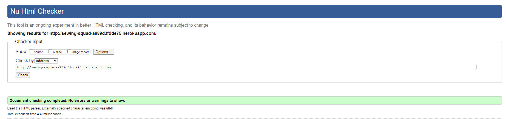
    
    
  

   * index.html (Home) - pass
      

      
Home

       

      

      
 

   * about.html - pass

      

      
About

       

      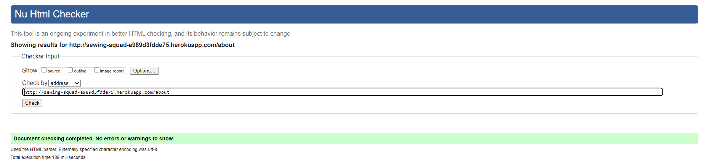

      
 

   * login.html - pass
     

     
Log In

      

     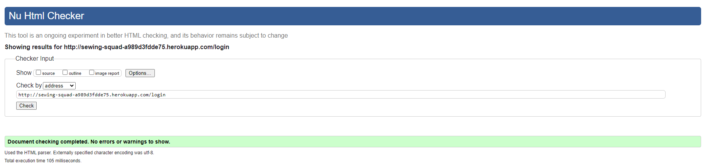

    
  

    
   * register.html - pass
     

     
Register

      

     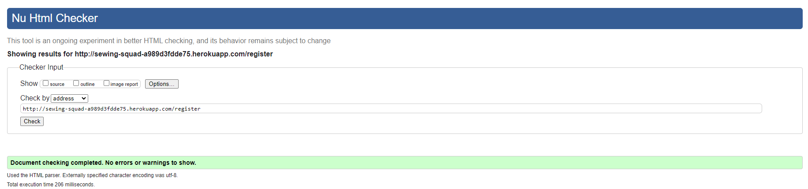

    
  

   * my_projects.html - pass
     

     
My Projects

      

     

    
      

   * add_project.html - pass
     

     
Add Project

      

     

    
  

   * edit_project.html - pass
     

     
Edit Project

      

     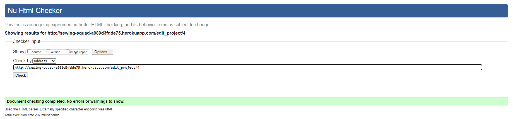

    
  

   * project.html - pass
     

     
Project

      

     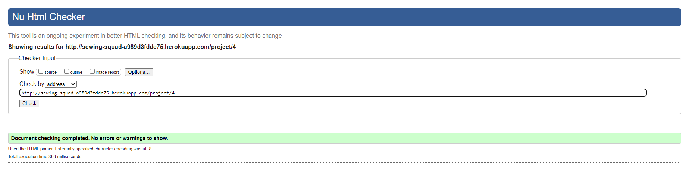

    
  

   * categories.html - pass
     

     
Categories

      

     

    
  

   * edit_category.html - pass
     

     
Edit Category

      

     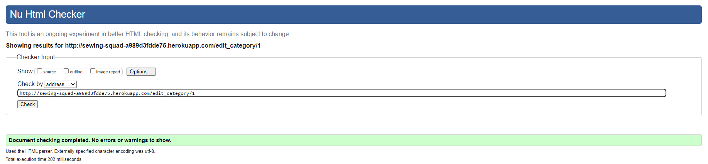

    

    * 404.html - pass
        

        
404 error

         

        

        
      
      

    

 * CSS Validator -pass

    

    
CSS Validator screenshot

     
 
    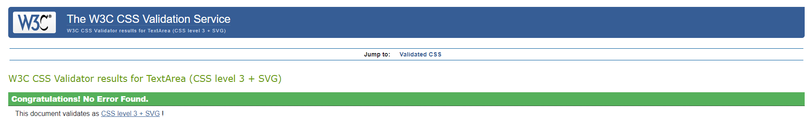

    
  

 * Javascript Validator (https://jshint.com/) -pass

    

    
JSHINT Validator screenshot

     
  
    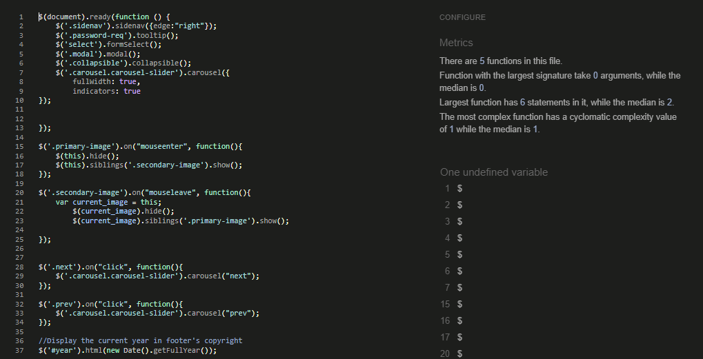

    
   

  ### Lighthouse

  

    
Home

     

  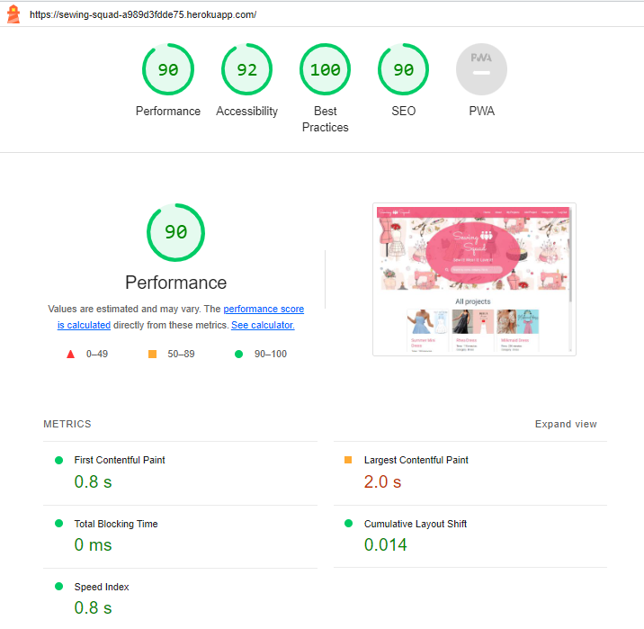

  
 

   

    
About

     

  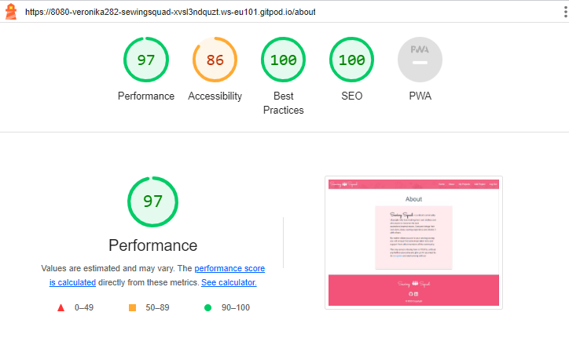

   
 

  

    
Log In

     

  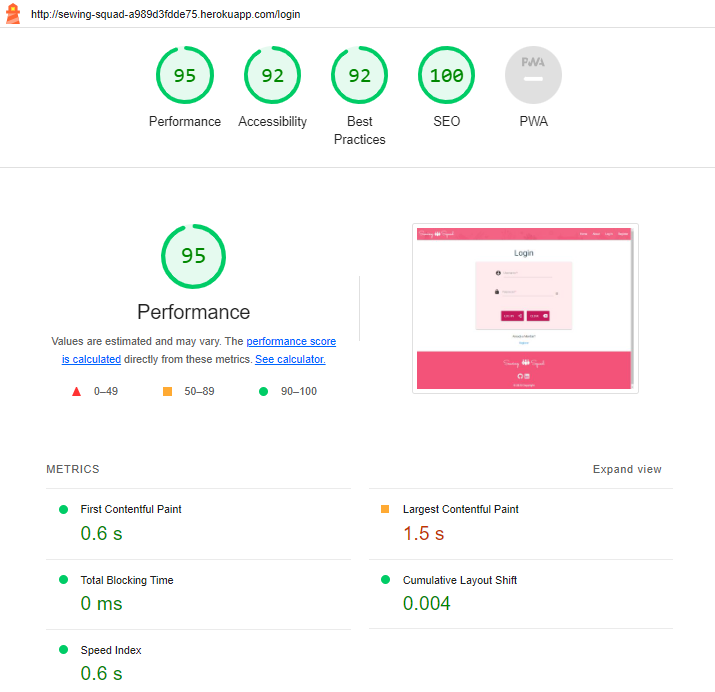

  
  

  

    
Register

     

  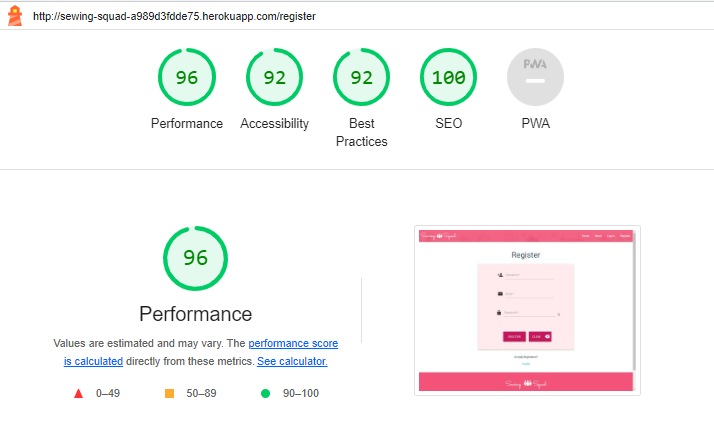

  
  

  

    
My Projects

     

  

  
      

  

    
Add Project

     

  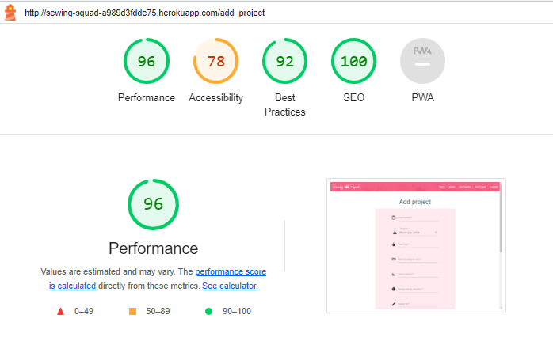

  
  

  

    
Edit Project

     

  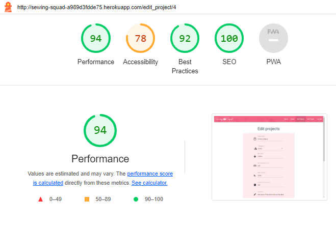

  
  

  

    
Project

     

  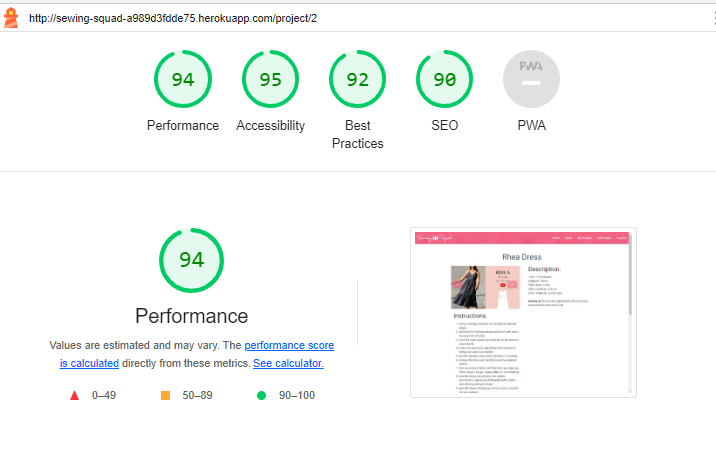

  
  

  
  

    
Categories

     

  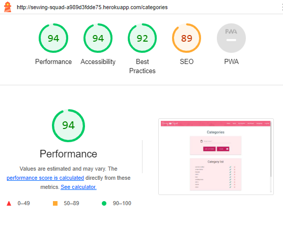

  
  

  

    
Edit Category

     

  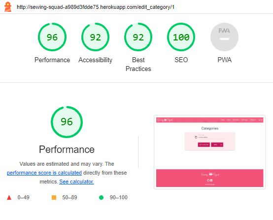

  

## Manual testing

### Testing user stories (Real user testing)

 User 1:   Device -  Samsung Galaxy S9, Browser: Samsung Browser

 

 Register

 

| User stories | Feature | Expected result | Actual result |
|  :---| :---|  :---|  :---|
| 18  | Register page| When I click Register button on the top right corner it takes me to registration page | Works as expected |
| 3  | Icons Placeholder text |I know exactly what information I need to enter and it is clearly indicated by icons and text in the input box   | Works as expected|
| 7 | Required field | When I submit the form with an empty field, a message appears prompting me to fill in that field | Works as expected|
| 6 | Information icon (i) (Helper text) | When I hover over the circle with i icon, it shows me how the password should look  | Works as expected|
| 4, 15, 18, 33 | Register button | When I click register button , a message "Your  registration was successful " appears and I am directed to log in page | Works as expected|
|3 | Clear button | When I click clear button, the text in the form disapears | Works as expected|
|3 | Navigation buttons - How to play on smaller devices| Instructions are easy to read and on smaller devices I have scroll option | Works as expected|
| 15, 18 | Link to Log in page | When I click Log in link under the form, it takes me to Log in page | Works as expected|

   

 Log in

 

| User stories | Feature | Expected result | Actual result |
|  :---| :---|  :---|  :---|
| 15, 20 | Login page | When I click Log In button on the top right corner it takes me to Log In page | Works as expected|
| 3 | Icons Placeholder text  | I know exactly what information I need to enter and it is clearly indicated by icons and text in the input box | Works as expected|
| 7 | Required field | When I submit the form with an empty field, a message appears prompting me to fill in that field | Works as expected|
| 6 | Information icon (i) (Helper text) | When I hover over the circle with i icon, it shows me how the password should look  | Works as expected|
| 3 | Clear button | When I click clear button the text in the for disapears | Works as expected|
| 18 | Link to Register page  | When I click Register link under the form, it takes me to Log in page  |  Works as expected |
| 7 | Log in button  | When I enter incorrect username and click the log in button, a message "Incorrect Username and/or Password" appears  |  Works as expected |
| 22, 15, 18 | Log in button  | When I click the log in button, a message "Welcome + my username" appears  and I am directed to my projects |  Works as expected |
| 15 | Header -Logged in user   | Once logged in, I can see Add project  and Log Out tabs  in the website header   |  Works as expected |
| 15 | Header -Logged in user  | Once logged in, Log in and Register tabs disappear from the website header  |  Works as expected |

 

 Log out

 
 
| User stories | Feature | Expected result | Actual result |
|  :---| :---|  :---|  :---|
| 15, 18 | Login Out button | When I click Log Out button on the top right corner, it takes me to log in page |  Works as expected |
| 18, 30 | Login Out button   | When I click Log Out button on the top right corner it logs me out of my account |  Works as expected |
| 15, 30 | Login Out button | When I click Log Out button on the top right corner, a message "You have been logged out" appears |  Works as expected |
| 15, 32 | Login Out button | When I click Log Out button on the top right corner, I can see Home, Log in and Register tabs in the page header  |  Works as expected |
| 15, 32| Login Out button | When I click Log Out button on the top right corner, My projects and Add project tabs disappear from the page header |  Works as expected |

 

 My project 

 

| User stories | Feature | Expected result | Actual result |
|  :---| :---|  :---|  :---|
| 18 | Add project button | When I click the 'add project' button it opens 'Add Project' form |  Works as expected |
| 2 39 | Card-panel | All the project which I have added are displayed on this page  |  Works as expected |
| 14 | Card-panel | When I click "See more information" link, it opens that specific project  |  Works as expected |
| 32 | Card-panel | When I am not logged in and I click on "See more information" I get a message that I need to be logged in to view the content |  Works as expected |
| 18 | Edit button | When I click Edit button, it opens an edit form|  Works as expected |
| 19 | Delete button | When I click Delete button, a modal appears |  Works as expected |

 Add Project

 

| User stories | Feature | Expected result | Actual result |
|  :---| :---|  :---|  :---|
| 8, 18 | Add project button (Header) | When I click the add project button in navidation menu, it opens an Add project form  |  Works as expected |
| 8, 18, 24 | Add project button (My projects page ) | WWhen I click the add project button on my projects page, it opens an Add project form | Works as expected |
| 3 | Icons Placeholder text  | I know exactly what information I need to enter and it is clearly indicated by icons and text in the input box |  Works as expected |
| 7 | Required field | When I submit the form with an empty field, a message appears prompting me to fill in that field |  Works as expected |
| 7 | Flash message | When I submit a form with the same project name, I get a message saying that 'This project already exists..' |  Works as expected |
| 15, 36, 34 | Add project button | When I click "Add" button  link under the form, it takes me back to my projects page and I can see this project there  |  Works as expected |
| 23, 15 | Add project button | When I click "Add" button  link under the form, a message appears saying "Your project was added successfully"  |  Works as expected |
| 15, 18 | Back button| When I click "back"  button it takes me back to the "My projects" page  |  Works as expected |

 

 Edit

 

| User stories | Feature | Expected result | Actual result |
|  :---| :---|  :---|  :---|
| 18, 25 | Edit button  | When I click the "Edit" button, it opens an "Edit project" form |  Works as expected |
| 3 | Icons Placeholder text  | I know exactly what information I need to enter and it is clearly indicated by icons and text in the input box  |  Works as expected |
| 7 | Required field | When I submit the form with an empty field, a message appears prompting me to fill in that field |  Works as expected |
| 15 | Edit project button | When I click "Edit" button link under the form, it takes me back to my projects page |  Works as expected |
| 15, 41 | Edit project button | When I click "Edit" button link under the form, a message appears saying "Your project has been successfully edited"  |  Works as expected |
| 25, 41, 39 | Edit project button | When I click "see more info.." link, I see the changes  |  Works as expected |
| 15 | Back button | When I click "back"  button it takes me back to the "My projects" page |  Works as expected |

 

 Home page

 

| User stories | Feature | Expected result | Actual result |
|  :---| :---|  :---|  :---|
| 18 | Home page | When I click on "Home" button it takes me to the page with all the projects |  Works as expected |
| 1, 43 | Hero image and the logo | I can see logo and the slogan  |  Works as expected |
| 9 , 11, 23, 37 | Card | I can see my projects and other peoples projects with basic information |  Works as expected |
| 9, 12 | Card | When I hover over pictures, another picture appears |  Works as expected |
| 26, 31, 41 | Edit project button | When I click on edit button of the project posted by other user, a message appears saying "You must be an admin or the owner of this post to edit it"  |  Works as expected |
| 25 | Edit project button | When I click on edit button of my own post, edit form opens  |  Works as expected |
| 27, 31, 42 | Delete project button | When I click on delete button of the project posted by other user, a message appears saying ""You don’t have permission to delete this  post….." |  Works as expected |
| 28 | Delete project button| When I click on delete button of my own post, I am asked to confirm the deletion  |  Works as expected |
| 28 | Delete Modal | When I click "Yes" button in modal the project disappears from my projects view |  Works as expected |
| 28 | Delete Modal | When I click "No" button, it takes my back to "My projects" page  |  Works as expected |

 

 Header

 

| User stories | Feature | Expected result | Actual result |
|  :---| :---|  :---|  :---|
| 18, 44 | Logo | When I click on logo, it brings me back to Home page |  Works as expected |
| 15, 18, 44 | Nav bar | All the links to other pages are clearly displayed in the right side of the header  |  Works as expected |
| 15, 18, 44 | Home button | When I click on "About" button it takes me to the page where I can read more about Sewing Squad |  Works as expected |
| 15, 18, 44 | My project button | When I click on "My projects" button it takes me to the page with my projects   |  Works as expected |
| 1, 15, 18, 44 | About page | WWhen I click on "About" button it takes me to the page where I can read more about Sewing Squad |  Works as expected |
| 15, 18, 44 | Add project | When I click on "Add project" button it opens a form to add a project |  Works as expected |
| 15, 18, 44| Log out  | When I click on "Log out" button it logs me out  |  Works as expected |

 

 Footer

 

| User stories | Feature | Expected result | Actual result |
|  :---| :---|  :---|  :---|
| 15, 18 | Logo | When I click on logo, it brigns me back to Home page |  Works as expected |
| 15, 18 | Github link | When I click on Github icon, it opnes Github page in a new tab  |  Works as expected |
| 15, 18 | Linked in link| When I click on Linked inicon, it opnes Linked in page in a new tab  |  Works as expected |
| 15 | Copyright with latest date  | Copyright shows actual year |  Works as expected |

 

 Search functionality

 

| User stories | Feature | Expected result | Actual result |
|  :---| :---|  :---|  :---|
| 10, 29 | Search  | When I type a word in search bar, it shows me only the posts which contain that word |  Works as expected |
| 10, 15,29 | Search | When the search brings one ore more results , a message appears showing number of results for that word  |  Works as expected |
| 10, 15,29 | Search  | When no posts contains the queried word , a message appears saying "Sorry! No results found for + the word. Please try another search  |  Works as expected |
| 15 | Helper text | The text under the search window shows clearly what type of words I can search for |  Works as expected |

 

 Project page

 

| User stories | Feature | Expected result | Actual result |
|  :---| :---|  :---|  :---|
| 38 | See more info link | When I click on "see more info" link, it will take me to the page for that project |  Works as expected |
| 31 | See more info link | When I am logged out and I click on "see more info" link, it will show a message that only registered users can view the project  |  Works as expected |
| 11 | Card | I can see summary information and instructions on this page  |  Works as expected |
| 9, 12 | Image | When I swipe the image or click on the arrow (on bigger devices) another picture appears  |  Works as expected |
| 15, 18 | View my projects button | When I click on view my project button, it takes me to My project page |  Works as expected |
| 15, 18 | View all projects button| When I click on view all project button, it takes me to Home page  |  Works as expected |

 

 Comment functionality

 

| User stories | Feature | Expected result | Actual result |
|  :---| :---|  :---|  :---|
| 19 | Add comment button | When I click add comment button, it adds the comment in th ecomment section above |  Works as expected |
| 19 | Comment button | When I click clear button, it clears the text area |  Works as expected |
| 19 | Comment button | I can see mine and other user's comments |  Works as expected |

 

 404 page

 

| User stories | Feature | Expected result | Actual result |
|  :---| :---|  :---|  :---|
| 41 | 404. html | When the game is not found I am directed to the page that tell me that the page is not found |  Works as expected |
| 42 | Back to the game button | When I click the back to the game button it takes me back to theMain menu  |  Works as expected |

 

 Admin access (categories page)

 

| User stories | Feature | Expected result | Actual result |
|  :---| :---|  :---|  :---|
| 35 | Add category | When I click add category, the category I wrote will appear in the category list |  Works as expected |
| 40 | Edit button | When I click the back to the game button it takes me back to theMain menu  |  Works as expected |
| 40 | Delete button | When I click the back to the game button it takes me back to theMain menu  |  Works as expected |
| 31 | Edit project button  | When I click the back to the game button it takes me back to theMain menu  |  Works as expected |
| 31 | Delete project button | When I click the back to the game button it takes me back to theMain menu  |  Works as expected |

 

 

 User 1:   Device -  Samsung Galaxy S9, Browser: Samsung Browser

 

 Register

 

| User stories | Feature | Expected result | Actual result |
|  :---| :---|  :---|  :---|
| 18  | Register page| When I click Register button on the top right corner it takes me to registration page | Works as expected |
| 3  | Icons Placeholder text |I know exactly what information I need to enter and it is clearly indicated by icons and text in the input box   | Works as expected|
| 7 | Required field | When I submit the form with an empty field, a message appears prompting me to fill in that field | Works as expected|
| 6 | Information icon (i) (Helper text) | When I hover over the circle with i icon, it shows me how the password should look  | Works as expected|
| 4, 15, 18, 33 | Register button | When I click register button , a message "Your  registration was successful " appears and I am directed to log in page | Works as expected|
|3 | Clear button | When I click clear button, the text in the form disapears | Works as expected|
|3 | Navigation buttons - How to play on smaller devices| Instructions are easy to read and on smaller devices I have scroll option | Works as expected|
| 15, 18 | Link to Log in page | When I click Log in link under the form, it takes me to Log in page | Works as expected|

   

 Log in

 

| User stories | Feature | Expected result | Actual result |
|  :---| :---|  :---|  :---|
| 15, 20 | Login page | When I click Log In button on the top right corner it takes me to Log In page | Works as expected|
| 3 | Icons Placeholder text  | I know exactly what information I need to enter and it is clearly indicated by icons and text in the input box | Works as expected|
| 7 | Required field | When I submit the form with an empty field, a message appears prompting me to fill in that field | Works as expected|
| 6 | Information icon (i) (Helper text) | When I hover over the circle with i icon, it shows me how the password should look  | Works as expected|
| 3 | Clear button | When I click clear button the text in the for disapears | Works as expected|
| 18 | Link to Register page  | When I click Register link under the form, it takes me to Log in page  |  Works as expected |
| 7 | Log in button  | When I enter incorrect username and click the log in button, a message "Incorrect Username and/or Password" appears  |  Works as expected |
| 22, 15, 18 | Log in button  | When I click the log in button, a message "Welcome + my username" appears  and I am directed to my projects |  Works as expected |
| 15 | Header -Logged in user   | Once logged in, I can see Add project  and Log Out tabs  in the website header   |  Works as expected |
| 15 | Header -Logged in user  | Once logged in, Log in and Register tabs disappear from the website header  |  Works as expected |

 

 Log out

 
 
| User stories | Feature | Expected result | Actual result |
|  :---| :---|  :---|  :---|
| 15, 18 | Login Out button | When I click Log Out button on the top right corner, it takes me to log in page |  Works as expected |
| 18, 30 | Login Out button   | When I click Log Out button on the top right corner it logs me out of my account |  Works as expected |
| 15, 30 | Login Out button | When I click Log Out button on the top right corner, a message "You have been logged out" appears |  Works as expected |
| 15, 32 | Login Out button | When I click Log Out button on the top right corner, I can see Home, Log in and Register tabs in the page header  |  Works as expected |
| 15, 32| Login Out button | When I click Log Out button on the top right corner, My projects and Add project tabs disappear from the page header |  Works as expected |

 

 My project 

 

| User stories | Feature | Expected result | Actual result |
|  :---| :---|  :---|  :---|
| 18 | Add project button | When I click the 'add project' button it opens 'Add Project' form |  Works as expected |
| 2 39 | Card-panel | All the project which I have added are displayed on this page  |  Works as expected |
| 14 | Card-panel | When I click "See more information" link, it opens that specific project  |  Works as expected |
| 32 | Card-panel | When I am not logged in and I click on "See more information" I get a message that I need to be logged in to view the content |  Works as expected |
| 18 | Edit button | When I click Edit button, it opens an edit form|  Works as expected |
| 19 | Delete button | When I click Delete button, a modal appears |  Works as expected |

 Add Project

 

| User stories | Feature | Expected result | Actual result |
|  :---| :---|  :---|  :---|
| 8, 18 | Add project button (Header) | When I click the add project button in navidation menu, it opens an Add project form  |  Works as expected |
| 8, 18, 24 | Add project button (My projects page ) | WWhen I click the add project button on my projects page, it opens an Add project form | Works as expected |
| 3 | Icons Placeholder text  | I know exactly what information I need to enter and it is clearly indicated by icons and text in the input box |  Works as expected |
| 7 | Required field | When I submit the form with an empty field, a message appears prompting me to fill in that field |  Works as expected |
| 7 | Flash message | When I submit a form with the same project name, I get a message saying that 'This project already exists..' |  Works as expected |
| 15, 36, 34 | Add project button | When I click "Add" button  link under the form, it takes me back to my projects page and I can see this project there  |  Works as expected |
| 23, 15 | Add project button | When I click "Add" button  link under the form, a message appears saying "Your project was added successfully"  |  Works as expected |
| 15, 18 | Back button| When I click "back"  button it takes me back to the "My projects" page  |  Works as expected |

 

 Edit

 

| User stories | Feature | Expected result | Actual result |
|  :---| :---|  :---|  :---|
| 18, 25 | Edit button  | When I click the "Edit" button, it opens an "Edit project" form |  Works as expected |
| 3 | Icons Placeholder text  | I know exactly what information I need to enter and it is clearly indicated by icons and text in the input box  |  Works as expected |
| 7 | Required field | When I submit the form with an empty field, a message appears prompting me to fill in that field |  Works as expected |
| 15 | Edit project button | When I click "Edit" button link under the form, it takes me back to my projects page |  Works as expected |
| 15, 41 | Edit project button | When I click "Edit" button link under the form, a message appears saying "Your project has been successfully edited"  |  Works as expected |
| 25, 41, 39 | Edit project button | When I click "see more info.." link, I see the changes  |  Works as expected |
| 15 | Back button | When I click "back"  button it takes me back to the "My projects" page |  Works as expected |

 

 Home page

 

| User stories | Feature | Expected result | Actual result |
|  :---| :---|  :---|  :---|
| 18 | Home page | When I click on "Home" button it takes me to the page with all the projects |  Works as expected |
| 1, 43 | Hero image and the logo | I can see logo and the slogan  |  Works as expected |
| 9 , 11, 23, 37 | Card | I can see my projects and other peoples projects with basic information |  Works as expected |
| 9, 12 | Card | When I hover over pictures, another picture appears |  Works as expected |
| 26, 31, 41 | Edit project button | When I click on edit button of the project posted by other user, a message appears saying "You must be an admin or the owner of this post to edit it"  |  Works as expected |
| 25 | Edit project button | When I click on edit button of my own post, edit form opens  |  Works as expected |
| 27, 31, 42 | Delete project button | When I click on delete button of the project posted by other user, a message appears saying ""You don’t have permission to delete this  post….." |  Works as expected |
| 28 | Delete project button| When I click on delete button of my own post, I am asked to confirm the deletion  |  Works as expected |
| 28 | Delete Modal | When I click "Yes" button in modal the project disappears from my projects view |  Works as expected |
| 28 | Delete Modal | When I click "No" button, it takes my back to "My projects" page  |  Works as expected |

 

 Header

 

| User stories | Feature | Expected result | Actual result |
|  :---| :---|  :---|  :---|
| 18, 44 | Logo | When I click on logo, it brings me back to Home page |  Works as expected |
| 15, 18, 44 | Nav bar | All the links to other pages are clearly displayed in the right side of the header  |  Works as expected |
| 15, 18, 44 | Home button | When I click on "About" button it takes me to the page where I can read more about Sewing Squad |  Works as expected |
| 15, 18, 44 | My project button | When I click on "My projects" button it takes me to the page with my projects   |  Works as expected |
| 1, 15, 18, 44 | About page | WWhen I click on "About" button it takes me to the page where I can read more about Sewing Squad |  Works as expected |
| 15, 18, 44 | Add project | When I click on "Add project" button it opens a form to add a project |  Works as expected |
| 15, 18, 44| Log out  | When I click on "Log out" button it logs me out  |  Works as expected |

 

 Footer

 

| User stories | Feature | Expected result | Actual result |
|  :---| :---|  :---|  :---|
| 15, 18 | Logo | When I click on logo, it brigns me back to Home page |  Works as expected |
| 15, 18 | Github link | When I click on Github icon, it opnes Github page in a new tab  |  Works as expected |
| 15, 18 | Linked in link| When I click on Linked inicon, it opnes Linked in page in a new tab  |  Works as expected |
| 15 | Copyright with latest date  | Copyright shows actual year |  Works as expected |

 

 Search functionality

 

| User stories | Feature | Expected result | Actual result |
|  :---| :---|  :---|  :---|
| 10, 29 | Search  | When I type a word in search bar, it shows me only the posts which contain that word |  Works as expected |
| 10, 15,29 | Search | When the search brings one ore more results , a message appears showing number of results for that word  |  Works as expected |
| 10, 15,29 | Search  | When no posts contains the queried word , a message appears saying "Sorry! No results found for + the word. Please try another search  |  Works as expected |
| 15 | Helper text | The text under the search window shows clearly what type of words I can search for |  Works as expected |

 

 Project page

 

| User stories | Feature | Expected result | Actual result |
|  :---| :---|  :---|  :---|
| 38 | See more info link | When I click on "see more info" link, it will take me to the page for that project |  Works as expected |
| 31 | See more info link | When I am logged out and I click on "see more info" link, it will show a message that only registered users can view the project  |  Works as expected |
| 11 | Card | I can see summary information and instructions on this page  |  Works as expected |
| 9, 12 | Image | When I swipe the image or click on the arrow (on bigger devices) another picture appears  |  Works as expected |
| 15, 18 | View my projects button | When I click on view my project button, it takes me to My project page |  Works as expected |
| 15, 18 | View all projects button| When I click on view all project button, it takes me to Home page  |  Works as expected |

 

 Comment functionality

 

| User stories | Feature | Expected result | Actual result |
|  :---| :---|  :---|  :---|
| 19 | Add comment button | When I click add comment button, it adds the comment in th ecomment section above |  Works as expected |
| 19 | Comment button | When I click clear button, it clears the text area |  Works as expected |
| 19 | Comment button | I can see mine and other user's comments |  Works as expected |

 

 404 page

 

| User stories | Feature | Expected result | Actual result |
|  :---| :---|  :---|  :---|
| 41 | 404. html | When the game is not found I am directed to the page that tell me that the page is not found |  Works as expected |
| 42 | Back to the game button | When I click the back to the game button it takes me back to theMain menu  |  Works as expected |

 

 
      

