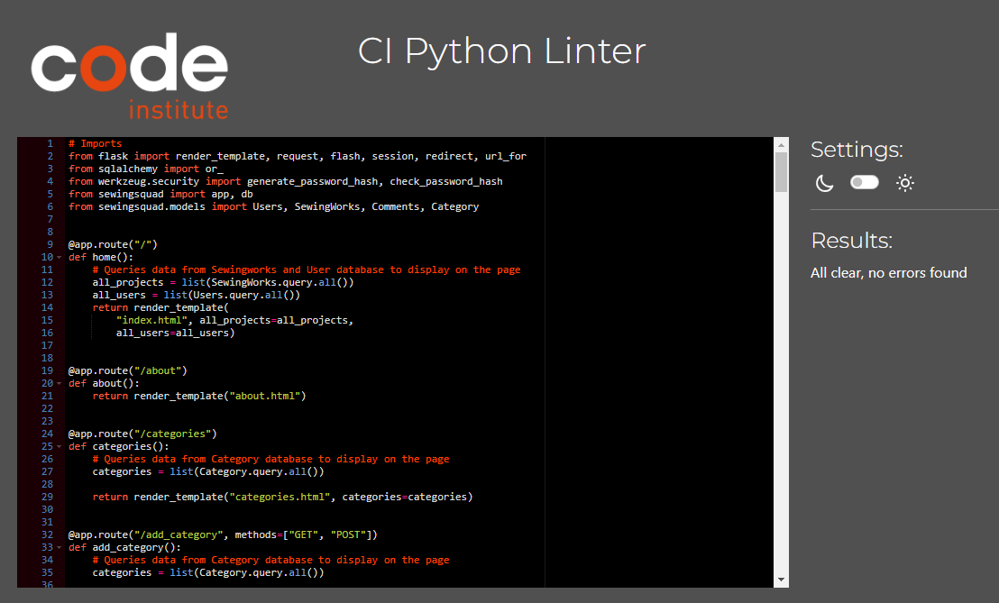
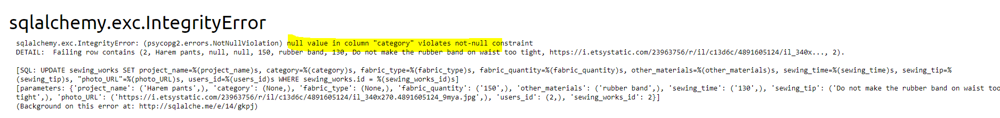
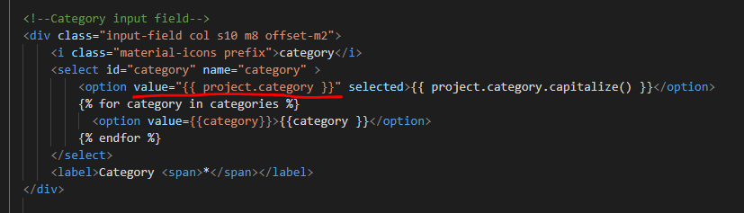

# Testing

## Automated Testing 

### CSS Validator (W3C)
 * HTML Validator 

   * base.html - pass
     

     
Base HTML

      

     
    
    
  

   * index.html (Home) - pass
      

      
Home

       

      

      
 

   * about.html - pass

      

      
About

       

      

      
 

   * login.html - pass
     

     
Log In

      

     

    
  

    
   * register.html - pass
     

     
Register

      

     

    
  

   * my_projects.html - pass
     

     
My Projects

      

     

    
      

   * add_project.html - pass
     

     
Add Project

      

     

    
  

   * edit_project.html - pass
     

     
Edit Project

      

     

    
  

   * project.html - pass
     

     
Project

      

     

    
  

   * categories.html - pass
     

     
Categories

      

     

    
  

   * edit_category.html - pass
     

     
Edit Category

      

     

    

    * 404.html - pass
        

        
404 error

         

        

        
      
      

    

 * CSS Validator -pass

    

    
CSS Validator screenshot

     
 
    

    
  

 * Javascript Validator (https://jshint.com/) -pass

    

    
JSHINT Validator screenshot

     
  
    

    
   

  * PEP8 Validator (https://pep8ci.herokuapp.com/) -pass

    

    
PEP8 Validator screenshot

     
  
    

    
 

  ### Lighthouse

  

    
Home

     

  

  
 

   

    
About

     

  

   
 

  

    
Log In

     

  

  
  

  

    
Register

     

  

  
  

  

    
My Projects

     

  

  
      

  

    
Add Project

     

  

  
  

  

    
Edit Project

     

  

  
  

  

    
Project

     

  

  
  

  
  

    
Categories

     

  

  
  

  

    
Edit Category

     

  

  

## Manual testing

### Testing user stories (Real user testing)

 User 1:   Device -  Samsung Galaxy S9, Browser: Samsung Browser

 

 Register

 

| User stories | Feature | Expected result | Actual result |
|  :---| :---|  :---|  :---|
| 18  | Register page| When I click Register button on the top right corner it takes me to registration page | Works as expected |
| 3  | Icons Placeholder text |I know exactly what information I need to enter and it is clearly indicated by icons and text in the input box   | Works as expected|
| 7 | Required field | When I submit the form with an empty field, a message appears prompting me to fill in that field | Works as expected|
| 6 | Information icon (i) (Helper text) | When I hover over the circle with i icon, it shows me how the password should look  | Works as expected|
| 4, 15, 18, 33 | Register button | When I click register button , a message "Your  registration was successful " appears and I am directed to log in page | Works as expected|
|3 | Clear button | When I click clear button, the text in the form disapears | Works as expected|
|3 | Navigation buttons - How to play on smaller devices| Instructions are easy to read and on smaller devices I have scroll option | Works as expected|
| 15, 18 | Link to Log in page | When I click Log in link under the form, it takes me to Log in page | Works as expected|

   

 Log in

 

| User stories | Feature | Expected result | Actual result |
|  :---| :---|  :---|  :---|
| 15, 20 | Login page | When I click Log In button on the top right corner it takes me to Log In page | Works as expected|
| 3 | Icons Placeholder text  | I know exactly what information I need to enter and it is clearly indicated by icons and text in the input box | Works as expected|
| 7 | Required field | When I submit the form with an empty field, a message appears prompting me to fill in that field | Works as expected|
| 6 | Information icon (i) (Helper text) | When I hover over the circle with i icon, it shows me how the password should look  | Works as expected|
| 3 | Clear button | When I click clear button the text in the for disapears | Works as expected|
| 18 | Link to Register page  | When I click Register link under the form, it takes me to Log in page  |  Works as expected |
| 7 | Log in button  | When I enter incorrect username and click the log in button, a message "Incorrect Username and/or Password" appears  |  Works as expected |
| 22, 15, 18 | Log in button  | When I click the log in button, a message "Welcome + my username" appears  and I am directed to my projects |  Works as expected |
| 15 | Header -Logged in user   | Once logged in, I can see Add project  and Log Out tabs  in the website header   |  Works as expected |
| 15 | Header -Logged in user  | Once logged in, Log in and Register tabs disappear from the website header  |  Works as expected |

 

 Log out

 
 
| User stories | Feature | Expected result | Actual result |
|  :---| :---|  :---|  :---|
| 15, 18 | Login Out button | When I click Log Out button on the top right corner, it takes me to log in page |  Works as expected |
| 18, 30 | Login Out button   | When I click Log Out button on the top right corner it logs me out of my account |  Works as expected |
| 15, 30 | Login Out button | When I click Log Out button on the top right corner, a message "You have been logged out" appears |  Works as expected |
| 15, 32 | Login Out button | When I click Log Out button on the top right corner, I can see Home, Log in and Register tabs in the page header  |  Works as expected |
| 15, 32| Login Out button | When I click Log Out button on the top right corner, My projects and Add project tabs disappear from the page header |  Works as expected |

 

 My project 

 

| User stories | Feature | Expected result | Actual result |
|  :---| :---|  :---|  :---|
| 18 | Add project button | When I click the 'add project' button it opens 'Add Project' form |  Works as expected |
| 2 39 | Card-panel | All the project which I have added are displayed on this page  |  Works as expected |
| 14 | Card-panel | When I click "See more information" link, it opens that specific project  |  Works as expected |
| 32 | Card-panel | When I am not logged in and I click on "See more information" I get a message that I need to be logged in to view the content |  Works as expected |
| 18 | Edit button | When I click Edit button, it opens an edit form|  Works as expected |
| 19 | Delete button | When I click Delete button, a modal appears |  Works as expected |

 Add Project

 

| User stories | Feature | Expected result | Actual result |
|  :---| :---|  :---|  :---|
| 8, 18 | Add project button (Header) | When I click the add project button in navidation menu, it opens an Add project form  |  Works as expected |
| 8, 18, 24 | Add project button (My projects page ) | WWhen I click the add project button on my projects page, it opens an Add project form | Works as expected |
| 3 | Icons Placeholder text  | I know exactly what information I need to enter and it is clearly indicated by icons and text in the input box |  Works as expected |
| 7 | Required field | When I submit the form with an empty field, a message appears prompting me to fill in that field |  Works as expected |
| 7 | Flash message | When I submit a form with the same project name, I get a message saying that 'This project already exists..' |  Works as expected |
| 15, 36, 34 | Add project button | When I click "Add" button  link under the form, it takes me back to my projects page and I can see this project there  |  Works as expected |
| 23, 15 | Add project button | When I click "Add" button  link under the form, a message appears saying "Your project was added successfully"  |  Works as expected |
| 15, 18 | Back button| When I click "back"  button it takes me back to the "My projects" page  |  Works as expected |

 

 Edit

 

| User stories | Feature | Expected result | Actual result |
|  :---| :---|  :---|  :---|
| 18, 25 | Edit button  | When I click the "Edit" button, it opens an "Edit project" form |  Works as expected |
| 3 | Icons Placeholder text  | I know exactly what information I need to enter and it is clearly indicated by icons and text in the input box  |  Works as expected |
| 7 | Required field | When I submit the form with an empty field, a message appears prompting me to fill in that field |  Works as expected |
| 15 | Edit project button | When I click "Edit" button link under the form, it takes me back to my projects page |  Works as expected |
| 15, 41 | Edit project button | When I click "Edit" button link under the form, a message appears saying "Your project has been successfully edited"  |  Works as expected |
| 25, 41, 39 | Edit project button | When I click "see more info.." link, I see the changes  |  Works as expected |
| 15 | Back button | When I click "back"  button it takes me back to the "My projects" page |  Works as expected |

 

 Home page

 

| User stories | Feature | Expected result | Actual result |
|  :---| :---|  :---|  :---|
| 18 | Home page | When I click on "Home" button it takes me to the page with all the projects |  Works as expected |
| 1, 43 | Hero image and the logo | I can see logo and the slogan  |  Works as expected |
| 9 , 11, 23, 37 | Card | I can see my projects and other peoples projects with basic information |  Works as expected |
| 9, 12 | Card | When I hover over pictures, another picture appears |  Works as expected |
| 26, 31, 41 | Edit project button | When I click on edit button of the project posted by other user, a message appears saying "You must be an admin or the owner of this post to edit it"  |  Works as expected |
| 25 | Edit project button | When I click on edit button of my own post, edit form opens  |  Works as expected |
| 27, 31, 42 | Delete project button | When I click on delete button of the project posted by other user, a message appears saying ""You don’t have permission to delete this  post….." |  Works as expected |
| 28 | Delete project button| When I click on delete button of my own post, I am asked to confirm the deletion  |  Works as expected |
| 28 | Delete Modal | When I click "Yes" button in modal the project disappears from my projects view |  Works as expected |
| 28 | Delete Modal | When I click "No" button, it takes my back to "My projects" page  |  Works as expected |

 

 Header

 

| User stories | Feature | Expected result | Actual result |
|  :---| :---|  :---|  :---|
| 18, 44 | Logo | When I click on logo, it brings me back to Home page |  Works as expected |
| 15, 18, 44 | Nav bar | All the links to other pages are clearly displayed in the right side of the header  |  Works as expected |
| 15, 18, 44 | Home button | When I click on "About" button it takes me to the page where I can read more about Sewing Squad |  Works as expected |
| 15, 18, 44 | My project button | When I click on "My projects" button it takes me to the page with my projects   |  Works as expected |
| 1, 15, 18, 44 | About page | WWhen I click on "About" button it takes me to the page where I can read more about Sewing Squad |  Works as expected |
| 15, 18, 44 | Add project | When I click on "Add project" button it opens a form to add a project |  Works as expected |
| 15, 18, 44| Log out  | When I click on "Log out" button it logs me out  |  Works as expected |

 

 Footer

 

| User stories | Feature | Expected result | Actual result |
|  :---| :---|  :---|  :---|
| 15, 18 | Logo | When I click on logo, it brigns me back to Home page |  Works as expected |
| 15, 18 | Github link | When I click on Github icon, it opnes Github page in a new tab  |  Works as expected |
| 15, 18 | Linked in link| When I click on Linked inicon, it opnes Linked in page in a new tab  |  Works as expected |
| 15 | Copyright with latest date  | Copyright shows actual year |  Works as expected |

 

 Search functionality

 

| User stories | Feature | Expected result | Actual result |
|  :---| :---|  :---|  :---|
| 10, 29 | Search  | When I type a word in search bar, it shows me only the posts which contain that word |  Works as expected |
| 10, 15,29 | Search | When the search brings one ore more results , a message appears showing number of results for that word  |  Works as expected |
| 10, 15,29 | Search  | When no posts contains the queried word , a message appears saying "Sorry! No results found for + the word. Please try another search  |  Works as expected |
| 15 | Helper text | The text under the search window shows clearly what type of words I can search for |  Works as expected |

 

 Project page

 

| User stories | Feature | Expected result | Actual result |
|  :---| :---|  :---|  :---|
| 38 | See more info link | When I click on "see more info" link, it will take me to the page for that project |  Works as expected |
| 31 | See more info link | When I am logged out and I click on "see more info" link, it will show a message that only registered users can view the project  |  Works as expected |
| 11 | Card | I can see summary information and instructions on this page  |  Works as expected |
| 9, 12 | Image | When I swipe the image or click on the arrow (on bigger devices) another picture appears  |  Works as expected |
| 15, 18 | View my projects button | When I click on view my project button, it takes me to My project page |  Works as expected |
| 15, 18 | View all projects button| When I click on view all project button, it takes me to Home page  |  Works as expected |

 

 Comment functionality

 

| User stories | Feature | Expected result | Actual result |
|  :---| :---|  :---|  :---|
| 19 | Add comment button | When I click add comment button, it adds the comment in the comment section above |  Works as expected |
| 19 | Clear button | When I click clear button, it clears the text area |  Works as expected |
| 19 | Comment area | I can see mine and other user's comments |  Works as expected |
| 19 | Comment button | When I click clear button, it clears the text area |  Works as expected |
| 19, 41 | Edit Comment icon| When I click edit icon (a pen)  next to my comment, edit form appears and I can change the text |  Works as expected |
| 19, 41 | Edit Comment button| When I click edit button in the edit comment form, orignal post gets udpated|  Works as expected |
| 19, 41 | Edit Comment icon| When I click edit icon (a pen)  next to someone else's comment, a message saying that I don't have permission appears |  Works as expected |
| 19, 41 | Delete Comment icon| When I click edit icon (a pen)  next to my comment, modal window appers asking me to confirm whether I want to delete the comment |  Works as expected |
| 19, 41 | Delete Comment Yes button| When I click Yes button, the comment gets deleted |  Works as expected |
| 19, 41 | Delete  Comment icon| When I click delete icon,X,  next to someone else's comment, a message saying that I don't have permission appears |  Works as expected |

 

 404 page

 

| User stories | Feature | Expected result | Actual result |
|  :---| :---|  :---|  :---|
| 7 | 404 page| When I click on the page that doesn’t exist, it brings me to the page  |  Works as expected |
| 15, 18 | Back to Home page button  | When I click "Back to main page "button, it brings me back to Home page  |  Works as expected |

 

 Admin access (categories page)

 

| User stories | Feature | Expected result | Actual result |
|  :---| :---|  :---|  :---|
| 35 | Add category | When I click add category, the category I wrote will appear in the category list |  Works as expected |
| 40 | Edit button | Only, I can edit categories  |  Works as expected |
| 40 | Delete button | Only, I can delete and edit categories  |  Works as expected |
| 31 | Edit button  | When I click edit project button of any user's project, edit form appears and I can edit the content |  Works as expected |
| 31 | Edit project button  | When I click edit project button the content of original project updates |  Works as expected |
| 31 | Delete project button | When I click delete button of any user's project, a modal appears asking me to confirm whether I want to delete it  |  Works as expected |
| 31 | Delete project - Yes button | When I click Yes in delete modal of any project, it gets deleted  |  Works as expected |
| 31 | Edit comment icon | When I click edit comment icon an edit fomr opens |  Works as expected |
| 31 | Edit comment button| When I click edit comment  button, orignal comment changes |  Works as expected |
| 31 | Delete comment icon | When I click delete comment icon, X, of any user's comment, a modal appears asking me to confirm whether I want to delete it  |  Works as expected |
| 31 | Delete comment icon - Yes button | When I click Yes in delete modal of any users's comment, it gets deleted  |  Works as expected |

 

 

 User 1:   Device -  Samsung Galaxy S9, Browser: Samsung Browser

 

 Register

 

| User stories | Feature | Expected result | Actual result |
|  :---| :---|  :---|  :---|
| 18  | Register page| When I click Register button on the top right corner it takes me to registration page | Works as expected |
| 3  | Icons Placeholder text |I know exactly what information I need to enter and it is clearly indicated by icons and text in the input box   | Works as expected|
| 7 | Required field | When I submit the form with an empty field, a message appears prompting me to fill in that field | Works as expected|
| 6 | Information icon (i) (Helper text) | When I hover over the circle with i icon, it shows me how the password should look  | Works as expected|
| 4, 15, 18, 33 | Register button | When I click register button , a message "Your  registration was successful " appears and I am directed to log in page | Works as expected|
|3 | Clear button | When I click clear button, the text in the form disapears | Works as expected|
|3 | Navigation buttons - How to play on smaller devices| Instructions are easy to read and on smaller devices I have scroll option | Works as expected|
| 15, 18 | Link to Log in page | When I click Log in link under the form, it takes me to Log in page | Works as expected|

   

 Log in

 

| User stories | Feature | Expected result | Actual result |
|  :---| :---|  :---|  :---|
| 15, 20 | Login page | When I click Log In button on the top right corner it takes me to Log In page | Works as expected|
| 3 | Icons Placeholder text  | I know exactly what information I need to enter and it is clearly indicated by icons and text in the input box | Works as expected|
| 7 | Required field | When I submit the form with an empty field, a message appears prompting me to fill in that field | Works as expected|
| 6 | Information icon (i) (Helper text) | When I hover over the circle with i icon, it shows me how the password should look  | Works as expected|
| 3 | Clear button | When I click clear button the text in the for disapears | Works as expected|
| 18 | Link to Register page  | When I click Register link under the form, it takes me to Log in page  |  Works as expected |
| 7 | Log in button  | When I enter incorrect username and click the log in button, a message "Incorrect Username and/or Password" appears  |  Works as expected |
| 22, 15, 18 | Log in button  | When I click the log in button, a message "Welcome + my username" appears  and I am directed to my projects |  Works as expected |
| 15 | Header -Logged in user   | Once logged in, I can see Add project  and Log Out tabs  in the website header   |  Works as expected |
| 15 | Header -Logged in user  | Once logged in, Log in and Register tabs disappear from the website header  |  Works as expected |

 

 Log out

 
 
| User stories | Feature | Expected result | Actual result |
|  :---| :---|  :---|  :---|
| 15, 18 | Login Out button | When I click Log Out button on the top right corner, it takes me to log in page |  Works as expected |
| 18, 30 | Login Out button   | When I click Log Out button on the top right corner it logs me out of my account |  Works as expected |
| 15, 30 | Login Out button | When I click Log Out button on the top right corner, a message "You have been logged out" appears |  Works as expected |
| 15, 32 | Login Out button | When I click Log Out button on the top right corner, I can see Home, Log in and Register tabs in the page header  |  Works as expected |
| 15, 32| Login Out button | When I click Log Out button on the top right corner, My projects and Add project tabs disappear from the page header |  Works as expected |

 

 My project 

 

| User stories | Feature | Expected result | Actual result |
|  :---| :---|  :---|  :---|
| 18 | Add project button | When I click the 'add project' button it opens 'Add Project' form |  Works as expected |
| 2 39 | Card-panel | All the project which I have added are displayed on this page  |  Works as expected |
| 14 | Card-panel | When I click "See more information" link, it opens that specific project  |  Works as expected |
| 32 | Card-panel | When I am not logged in and I click on "See more information" I get a message that I need to be logged in to view the content |  Works as expected |
| 18 | Edit button | When I click Edit button, it opens an edit form|  Works as expected |
| 19 | Delete button | When I click Delete button, a modal appears |  Works as expected |

 Add Project

 

| User stories | Feature | Expected result | Actual result |
|  :---| :---|  :---|  :---|
| 8, 18 | Add project button (Header) | When I click the add project button in navidation menu, it opens an Add project form  |  Works as expected |
| 8, 18, 24 | Add project button (My projects page ) | WWhen I click the add project button on my projects page, it opens an Add project form | Works as expected |
| 3 | Icons Placeholder text  | I know exactly what information I need to enter and it is clearly indicated by icons and text in the input box |  Works as expected |
| 7 | Required field | When I submit the form with an empty field, a message appears prompting me to fill in that field |  Works as expected |
| 7 | Flash message | When I submit a form with the same project name, I get a message saying that 'This project already exists..' |  Works as expected |
| 15, 36, 34 | Add project button | When I click "Add" button  link under the form, it takes me back to my projects page and I can see this project there  |  Works as expected |
| 23, 15 | Add project button | When I click "Add" button  link under the form, a message appears saying "Your project was added successfully"  |  Works as expected |
| 15, 18 | Back button| When I click "back"  button it takes me back to the "My projects" page  |  Works as expected |

 

 Edit

 

| User stories | Feature | Expected result | Actual result |
|  :---| :---|  :---|  :---|
| 18, 25 | Edit button  | When I click the "Edit" button, it opens an "Edit project" form |  Works as expected |
| 3 | Icons Placeholder text  | I know exactly what information I need to enter and it is clearly indicated by icons and text in the input box  |  Works as expected |
| 7 | Required field | When I submit the form with an empty field, a message appears prompting me to fill in that field |  Works as expected |
| 15 | Edit project button | When I click "Edit" button link under the form, it takes me back to my projects page |  Works as expected |
| 15, 41 | Edit project button | When I click "Edit" button link under the form, a message appears saying "Your project has been successfully edited"  |  Works as expected |
| 25, 41, 39 | Edit project button | When I click "see more info.." link, I see the changes  |  Works as expected |
| 15 | Back button | When I click "back"  button it takes me back to the "My projects" page |  Works as expected |

 

 Home page

 

| User stories | Feature | Expected result | Actual result |
|  :---| :---|  :---|  :---|
| 18 | Home page | When I click on "Home" button it takes me to the page with all the projects |  Works as expected |
| 1, 43 | Hero image and the logo | I can see logo and the slogan  |  Works as expected |
| 9 , 11, 23, 37 | Card | I can see my projects and other peoples projects with basic information |  Works as expected |
| 9, 12 | Card | When I hover over pictures, another picture appears |  Works as expected |
| 26, 31, 41 | Edit project button | When I click on edit button of the project posted by other user, a message appears saying "You must be an admin or the owner of this post to edit it"  |  Works as expected |
| 25 | Edit project button | When I click on edit button of my own post, edit form opens  |  Works as expected |
| 27, 31, 42 | Delete project button | When I click on delete button of the project posted by other user, a message appears saying ""You don’t have permission to delete this  post….." |  Works as expected |
| 28 | Delete project button| When I click on delete button of my own post, I am asked to confirm the deletion  |  Works as expected |
| 28 | Delete Modal | When I click "Yes" button in modal the project disappears from my projects view |  Works as expected |
| 28 | Delete Modal | When I click "No" button, it takes my back to "My projects" page  |  Works as expected |

 

 Header

 

| User stories | Feature | Expected result | Actual result |
|  :---| :---|  :---|  :---|
| 18, 44 | Logo | When I click on logo, it brings me back to Home page |  Works as expected |
| 15, 18, 44 | Nav bar | All the links to other pages are clearly displayed in the right side of the header  |  Works as expected |
| 15, 18, 44 | Home button | When I click on "About" button it takes me to the page where I can read more about Sewing Squad |  Works as expected |
| 15, 18, 44 | My project button | When I click on "My projects" button it takes me to the page with my projects   |  Works as expected |
| 1, 15, 18, 44 | About page | WWhen I click on "About" button it takes me to the page where I can read more about Sewing Squad |  Works as expected |
| 15, 18, 44 | Add project | When I click on "Add project" button it opens a form to add a project |  Works as expected |
| 15, 18, 44| Log out  | When I click on "Log out" button it logs me out  |  Works as expected |

 

 Footer

 

| User stories | Feature | Expected result | Actual result |
|  :---| :---|  :---|  :---|
| 15, 18 | Logo | When I click on logo, it brigns me back to Home page |  Works as expected |
| 15, 18 | Github link | When I click on Github icon, it opnes Github page in a new tab  |  Works as expected |
| 15, 18 | Linked in link| When I click on Linked inicon, it opnes Linked in page in a new tab  |  Works as expected |
| 15 | Copyright with latest date  | Copyright shows actual year |  Works as expected |

 

 Search functionality

 

| User stories | Feature | Expected result | Actual result |
|  :---| :---|  :---|  :---|
| 10, 29 | Search  | When I type a word in search bar, it shows me only the posts which contain that word |  Works as expected |
| 10, 15,29 | Search | When the search brings one ore more results , a message appears showing number of results for that word  |  Works as expected |
| 10, 15,29 | Search  | When no posts contains the queried word , a message appears saying "Sorry! No results found for + the word. Please try another search  |  Works as expected |
| 15 | Helper text | The text under the search window shows clearly what type of words I can search for |  Works as expected |

 

 Project page

 

| User stories | Feature | Expected result | Actual result |
|  :---| :---|  :---|  :---|
| 38 | See more info link | When I click on "see more info" link, it will take me to the page for that project |  Works as expected |
| 31 | See more info link | When I am logged out and I click on "see more info" link, it will show a message that only registered users can view the project  |  Works as expected |
| 11 | Card | I can see summary information and instructions on this page  |  Works as expected |
| 9, 12 | Image | When I swipe the image or click on the arrow (on bigger devices) another picture appears  |  Works as expected |
| 15, 18 | View my projects button | When I click on view my project button, it takes me to My project page |  Works as expected |
| 15, 18 | View all projects button| When I click on view all project button, it takes me to Home page  |  Works as expected |

 

 Comment functionality

 

| User stories | Feature | Expected result | Actual result |
|  :---| :---|  :---|  :---|
| 19 | Add comment button | When I click add comment button, it adds the comment in th ecomment section above |  Works as expected |
| 19 | Comment button | When I click clear button, it clears the text area |  Works as expected |
| 19 | Comment button | I can see mine and other user's comments |  Works as expected |

 

 404 page

 

| User stories | Feature | Expected result | Actual result |
|  :---| :---|  :---|  :---|
| 41 | 404. html | When the game is not found I am directed to the page that tell me that the page is not found |  Works as expected |
| 42 | Back to the game button | When I click the back to the game button it takes me back to theMain menu  |  Works as expected |

 

 
      

## Bugs

### Solved bugs 
 |  Expected |  Bug |  Fix |
 |  :---| :---|  :---|
 | In Edit form, the user should only need to amend the fields which they want to change the rest should stay the same with the prepopulated text | Once the user changes the fields which they wish to update and submit the edit button, ait will return null value error for category field   | Value {{ project.category }} was added to selected option for category in edit_project.html  |
 | When users fills in add project form and clicks add project it should upload data to database  | When users clicks add project button with project name which already is in database, it returns duplicte key error  | The project name unique key is set to True and therefore the project name must be unique. Code was added to add_project function  to first check whether this name already exists in database and show the flash message informing the user to choose another usernam| 
 | The user should not be able to edit project without being logged in | When user clicked on edit project without being logged in it returned Key Error | The code in edit_project function was wrapped in try-except block which will capture when the "user" key is not found in the session dictionary and return flash message infroming user that they must be logged in if they want to edit post. This ensures that the user-related code is only executed when the "user" key is found in the session dictionary. For more details see code in routes.py Line 256-303|
 | Cards should be placed next to each other | The cards were positioned with big gaps from each other leaving a lot of blank space | The materialize class had to be changed from l3 to l4 for large devices so the cards would take one third of the space
 | When the user clicks on the area where the matched cards used be it should not react| The animal sound was played when clicked on the area where matched pictures used to be and when clicked on two matching the sound was played |  Added condition to apply the cardTurns function only to those cards which don't have matched class
 | When match is found the cards fade out | The outline of the cards stayed visible  | Styling added to the card class (.card) to set the border to none |
 | When users clicks on the card and it flips only the front of the card should be visible| When card was flipped to the front of the card the white outline was visible in the background  | style property was added to remove the visibility of the front card when it flips|
 |It is not possible for the user to submit their score if the input field is empty | The text got submitted even when the user didn't enter their name | The 'save to scoreboard' button was disabled and an even listener was added to remove the disabled attribute when the key is up|
 | Time's up message appears on the screen when user doesn't find all the matched before time goes to 0 | The message kept appearing every second under the previous message | The variable timeCountdown was updated to global variable

### Known bugs
There are no known bugs
