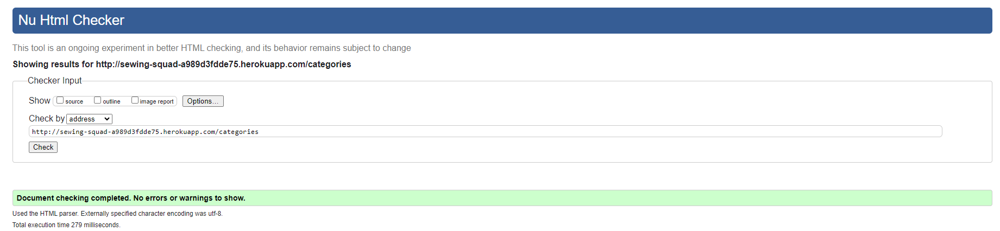

# Testing

## Automated Testing 

### CSS Validator (W3C)
 * HTML Validator 

   * base.html - pass
     

     
Base HTML

      

     
    
    
  

   * index.html (Home) - pass
      

      
Home

       

      

      
 

   * about.html - pass

      

      
About

       

      

      
 

   * login.html - pass
     

     
Log In

      

     

    
  

    
   * register.html - pass
     

     
Register

      

     

    
  

   * my_projects.html - pass
     

     
My Projects

      

     

    
      

   * add_project.html - pass
     

     
Add Project

      

     

    
  

   * edit_project.html - pass
     

     
Edit Project

      

     

    
  

   * project.html - pass
     

     
Project

      

     

    
  

   * categories.html - pass
     

     
Categories

      

     

    
  

   * edit_category.html - pass
     

     
Edit Category

      

     

    

    * 404.html - pass
        

        
404 error

         

        

        
      
      

    

 * CSS Validator -pass
    
   

   
CSS Validator screenshot

    
 
   

   
  

  * Javascript Validator (https://jshint.com/) -pass

    

    
JSHINT Validator screenshot

     
  
    

    
   

  ### Lighthouse

  

    
Home

     

    

  
 

   

    
About

     

    

   
 

  

    
Log In

     

    

  
  

  

    
Register

     

  

  
  

  

    
My Projects

     

    

  
      

  

    
Add Project

     

    

  
  

  

    
Edit Project

     

    

  
  

  

    
Project

     

    

  
  

  
  

    
Categories

     

    

  
  

  

    
Edit Category

     

    

  

   

      
404 error

       

      

   
      
      

